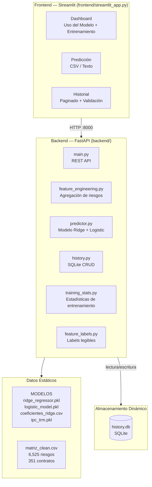
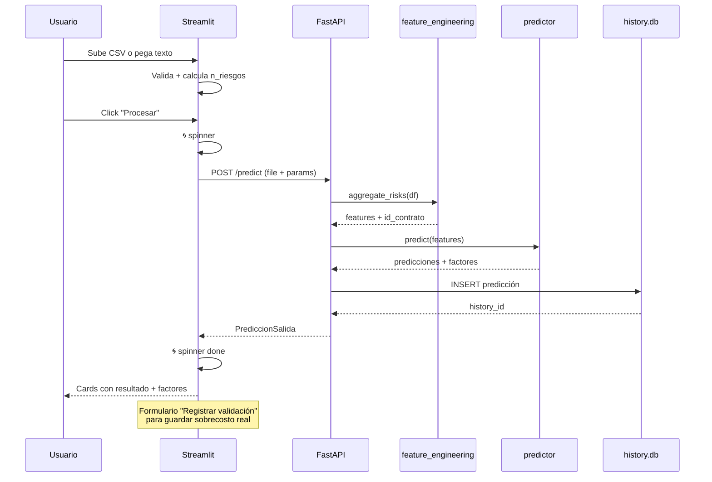
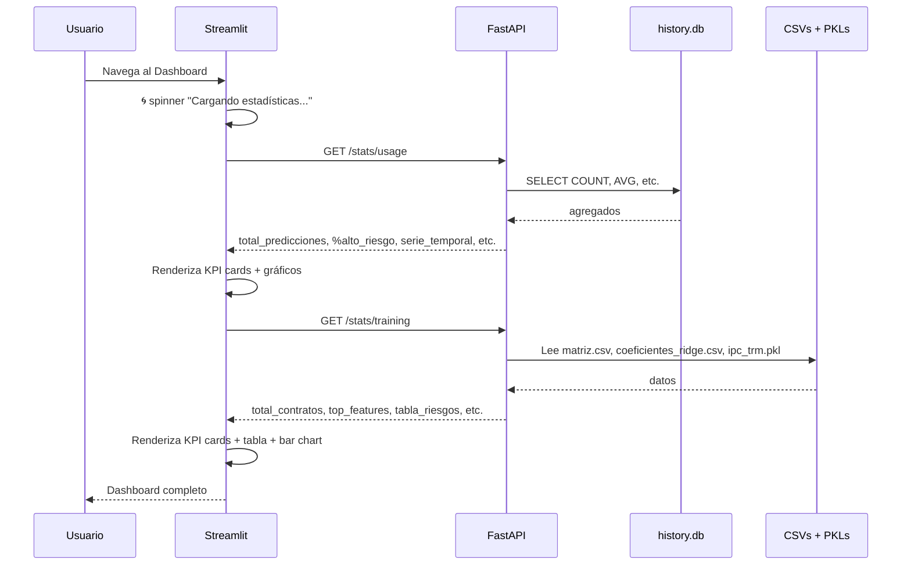
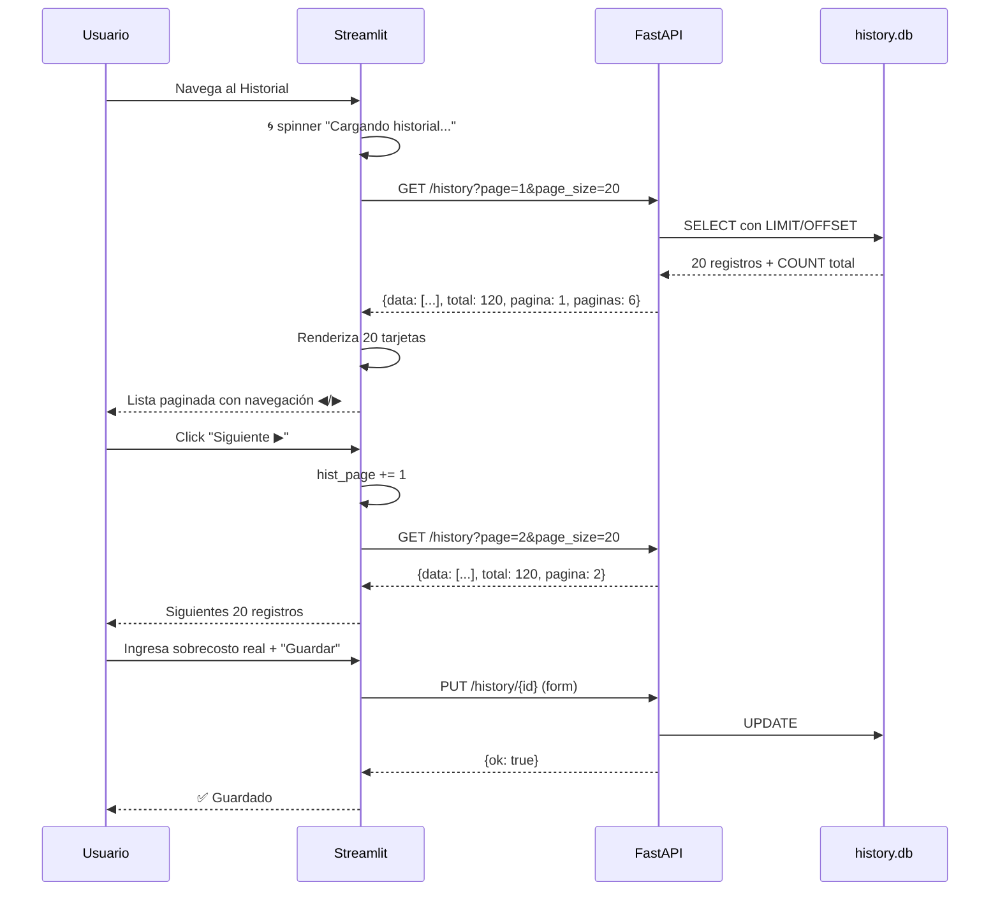
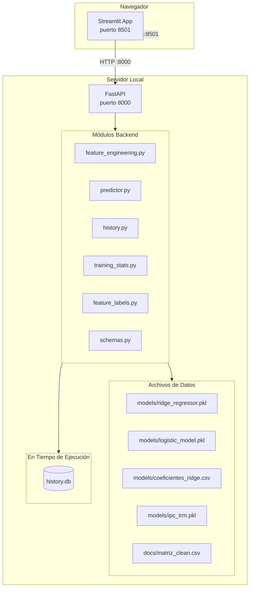
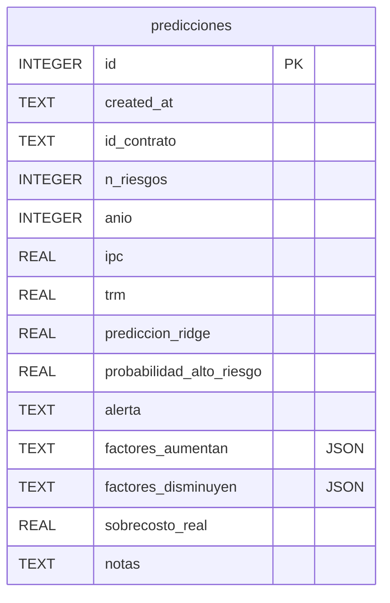

# Proceso de Identificación de Proyectos de Desarrollo Público en SECOP

## Contexto

**Tesis:** Maestría de José Luis Santamaría Andrade  
**Tema:** Predicción ML de matrices de riesgo en contratos públicos de Colombia  
**Objetivo del dato:** Identificar proyectos de inversión (Obra) terminados, con URL para acceder a matrices de riesgo, y con sobrecosto calculable como variable objetivo.

---

## 1. Fuentes de Datos

| # | ID | Nombre | Registros | Columnas | URL API |
|---|---|---|---|---|---|
| 1 | `f789-7hwg` | SECOP I - Procesos de Compra Pública | ~2.5M | 79 | `/resource/f789-7hwg.json` |
| 2 | `jbjy-vk9h` | SECOP II - Contratos Electrónicos | ~5.6M | 84+ | `/resource/jbjy-vk9h.json` |
| 3 | `5dsw-vah3` | SECOP II - Detalle | ~180K | 64 | `/resource/5dsw-vah3.json` |
| 4 | `bqww-w6pq` | SECOP I+II Integrado | ~22M | 10 | Descartado (pocas columnas) |

**Decisión final:** Usar SECOP I (`f789-7hwg`) para datos históricos liquidados y SECOP II (`jbjy-vk9h`) para datos recientes terminados. Ambos vía API de datos.gov.co con paginación (`$limit=50000`, `$offset`).

---

## 2. Pipeline de Extracción y Depuración

### 2.1 Scripts del proyecto

| Script | Función |
|---|---|
| `unificar_secop.py` | Descarga desde API SECOP I + II, cachea local, unifica en tabla común |
| `depurar.py` | Lee los cache, normaliza columnas, aplica filtros, exporta CSV depurado |
| `separar_fuentes.py`             | Divide `proyectos_depurados.csv` en SECOP I y SECOP II, elimina duplicados por URL en SECOP I |
| `excel_lite.py`                  | Versión reducida con columnas esenciales; SECOP I lite solo con `sobrecosto_pct > 0` |

### 2.2 Flujo de datos

```
SECOP I API (f789-7hwg)  ──┐
                           ├──> unificar_secop.py ──> cache CSV ──> depurar.py ──> proyectos_depurados.csv
SECOP II API (jbjy-vk9h) ──┘
```

### 2.3 Filtros aplicados (en orden)

| # | Paso | Descripción | Cómo |
|---|---|---|---|
| 1 | Tipo de contrato | Solo **Obra** | `tipo_de_contrato = 'Obra'` en query API |
| 2 | Destino del gasto | Solo **Inversión** | `destino_gasto = 'Inversión'` (SECOP I en query, SECOP II en post-filtro) |
| 3 | Valor mínimo | ≥ **$500M COP** | `valor_inicial >= 500e6` |
| 4 | Estado | Solo **terminados/liquidados/cerrados** | `estado in ('Liquidado', 'terminado', 'Cerrado')` |
| 5 | URL | Debe tener **URL válida** | `url` no nula ni vacía |
| 6 | Entidad | Debe tener **nombre de entidad** | `entidad` no vacía |

---

## 3. Variable Objetivo: Sobrecosto

### 3.1 Definición

```
sobrecosto_pct = ((valor_final - valor_inicial) / valor_inicial) × 100
```

### 3.2 Origen de los valores

| Fuente | valor_inicial | valor_final | Nota |
|---|---|---|---|---|
| SECOP I | `cuantia_contrato` | `valor_contrato_con_adiciones` | ✅ Adiciones incluidas, sobrecosto calculable |
| SECOP II | `valor_del_contrato` | `max(valor_pagado, valor_facturado)` | ⚠️ API no tiene columna de adiciones. Solo 5 registros con sobrecosto > 1% |

### 3.3 Interpretación

| Resultado | Significado |
|---|---|
| **+20%** | El proyecto costó 20% más de lo planeado → **sobrecosto** |
| **0%** | Costo final = costo inicial (sin cambios registrados) |
| **−10%** | El proyecto costó 10% menos → **ahorro** |
| **NaN** | No hay dato de valor_final (SECOP II sin pagos registrados) |

---

## 4. Resultados

### 4.1 Resumen numérico

| Etapa | SECOP I | SECOP II | Total |
|---|---|---|---|---|
| Descargados | 35,233 | 16,298 | 51,531 |
| Inversión | 35,233 | 10,848 | 46,081 |
| ≥ $500M | 5,500 | 3,446 | 8,946 |
| Terminados | 5,500 | 3,446 | **8,946** |
| Con URL | 5,500 | 3,446 | **8,946** |
| Con entidad | 5,500 | 3,446 | **8,946** |
| **Con sobrecosto ≠ 0** | 1,870 | 911 | **2,781** |
| Sobrecosto negativo eliminado | — | 908 | **908** |
| **Dataset final (`proyectos_depurados.csv`)** | **5,500** | **2,538** | **8,038** |
| Duplicados por URL (post-separación) | 777 | — | **777** |
| **SECOP I sin duplicados (`proyectos_secop1.csv`)** | **4,723** | — | **4,723** |
| Con sobrecosto > 0 (SECOP I lite) | **1,560** | — | **1,560** |

> **Nota:** El modelo ML se entrenó con **350 contratos** — aquellos que tienen matriz de riesgo extraída en `docs/matriz_clean.csv`. Los 1,560 son el pool total de candidatos SECOP I con sobrecosto > 0; el resto no alcanzó a tener su matriz extraída (proceso manual: PDF → OCR → LLM). Los 5 contratos SECOP II mapeados (C-110 a C-114) están incluidos dentro de esos 350.

### 4.2 Estadísticas de sobrecosto

| Métrica | Valor |
|---|---|
| Media | +11.9% |
| Mediana | 0.0% |
| Mínimo | 0.0% |
| Máximo | +24,972.8% (outlier, error de datos) |
| Proyectos con > 0% (SECOP I dedup) | 1,873 (1,560 en SECOP I) |
| Proyectos con < 0% | 0 (eliminados) |
| Proyectos con = 0% | 4,204 |

### 4.3 Columnas del dataset final (`proyectos_depurados.csv`)

| # | Columna | Descripción |
|---|---|---|
| 1 | `fuente` | SECOP I o SECOP II |
| 2 | `entidad` | Nombre de la entidad contratante |
| 3 | `departamento` | Departamento de ejecución |
| 4 | `municipio` | Municipio de ejecución |
| 5 | `valor_inicial` | Valor inicial del contrato |
| 6 | `valor_final` | Valor final (con adiciones o pagado) |
| 7 | `adiciones_dias` | Días de adición al plazo |
| 8 | `plazo_dias` | Plazo inicial en días |
| 9 | **`sobrecosto_pct`** | Variable objetivo: sobrecosto porcentual |
| 10 | `retraso_pct` | Retraso porcentual (adiciones/plazo) |
| 11 | `estado` | Estado del proceso |
| 12 | `objeto` | Descripción textual del contrato |
| 13 | **`url`** | URL en SECOP para acceder a matrices de riesgo |
| 14 | `contratista` | Proveedor adjudicado |
| 15 | `fecha_inicio` | Fecha de inicio |
| 16 | `fecha_fin` | Fecha de fin |
| 17 | `postconflicto` | Flag de acuerdo de paz (1=Sí, 0=No) |
| 18 | `destino_gasto` | Inversión (uniforme) |

---

### 4.4 Diagnóstico SECOP II — Complemento de 5 contratos

Durante la investigación se determinó que **SECOP II** (`jbjy-vk9h`) no expone datos confiables para calcular sobrecosto:

| Problema | Detalle |
|---|---|
| Sin columna de adiciones | No existe `valor_total_de_adiciones` ni `valor_contrato_con_adiciones` |
| `valor_pagado` = 0 | 49% de los registros tienen valor_pagado=0 (sin pagos registrados) |
| `valor_pagado ≈ valor_del_contrato` | Cuando hay pago, casi siempre es igual al valor del contrato (0% sobrecosto) |
| Portal con ReCaptcha | community.secop.gov.co bloquea scraping automatizado |
| Datasets alternativos | `6u7i-acw2` (salud, no SECOP), `vqec-u7ms` (Adiciones SECOP, vacío) |

Sin embargo, al revisar `docs/matriz.csv` se encontraron **5 contratos** con estructura de URL diferente (`community.secop.gov.co` en vez de `contratos.gov.co`). Estos se mapearon al `secop2_cache.csv` usando el `noticeUID` de la URL. Todos existen en la tabla `urlproceso` del cache SECOP II:

| Entidad | valor_inicial | valor_final | Sobrecosto |
|---|---|---|---|
| Caja de la Vivienda Popular (Grupo I) | $2,742M | $4,560M | +66.29% |
| Municipio de Entrerríos | $242M | $271M | +11.85% |
| ICBF Regional Tolima | $592M | $613M | +3.55% |
| Fondo Adaptación | $19,872M | $20,273M | +2.02% |
| Rama Judicial – Montería | $1,161M | $1,161M | +0.00% |

Los 4 primeros tienen sobrecosto real positivo. Rama Judicial tiene sobrecosto ~0% (incluido como testigo). Nota: en `secop2_cache` el noticeUID `CO1.NTC.2222959` (Caja de la Vivienda Popular) tiene 2 sub-contratos (Grupo I y III); el Grupo III arroja sobrecosto negativo (-5.24%) y se excluye del conjunto.

**Decisión final:** El dataset base del proyecto es **SECOP I** (4,723 registros, 1,560 con sobrecosto > 0). SECOP II se incluye como complemento menor (5 contratos en `contratos/secop2_con_sobrecosto.csv`). La tesis se sustenta principalmente en SECOP I.

---

## 5. Matrices de Riesgo

### 5.1 Dataset `matriz.csv`

**Ubicación original:** `C:\Users\Santa\Documents\Tesis\Matrices\matriz.csv` (copia en `docs/matriz.csv`)  
**Versión normalizada:** `docs/matriz_clean.csv` — generada por `estudio_data/normalizar.py`

El dataset original tiene 131 filas malformadas (padding/truncado a 20 columnas por mal quoting CSV) que se reparan automáticamente durante la normalización. El proceso NO modifica `matriz.csv`, solo lee de él y escribe `matriz_clean.csv`.

### 5.2 Pipeline de Normalización

`estudio_data/normalizar.py` aplica las siguientes transformaciones sobre `matriz.csv` para producir `matriz_clean.csv`:

| # | Transformación | Detalle |
|---|---|---|
| 1 | Lowercase + tildes | `quitar_tildes()` + `.lower()` en todas las columnas textuales |
| 2 | Espacios múltiples | `re.sub(r'\s+', ' ', s)` — colapsa espacios |
| 3 | **clase** (82→22 vars) | Mapeo de 60+ patrones regex a taxonomía SECOP canónica |
| 4 | **asignacion** (279→10 vars) | Mapa exacto + detección de entidades/contratistas + catch-all para textos descriptivos |
| 5 | **tipo** (265→17 vars) | Patrones multi-riesgo, palabras clave, mapa exacto |
| 6 | **etapa** (109→23 vars) | Patrones exactos + división de compuestos (`/`, `-`, `y`) con palabras clave |
| 7 | **fuente_riesgo** (47→4 vars) | Mapeo a `interno`, `externo`, `mixto`, `no especificado` |
| 8 | **probabilidad** (38→6 vars) | Escalas mixtas (0-1, 0-10, porcentual, textual) → 1-5 |
| 9 | **impacto** (40→6 vars) | Idem probabilidad |
| 10 | **categoria** (43→5 vars) | Textos → `bajo/medio/alto/extremo`; numéricos escalados con matriz estándar |
| 11 | **valoracion** (47 vars) | Ratings textuales → numérico; decimales .0 → enteros |
| 12 | Filas malformadas | Padding a 20 columnas si faltan, truncado si sobran |

**Resultado:** 72,123 normalizaciones aplicadas, 131 filas reparadas, 0 tildes, 0 valores numéricos no normalizados.

### 5.3 Columnas

| # | Columna | Descripción |
|---|---|---|
| 1 | `id_contrato` | Identificador único del contrato en la matriz |
| 2 | `valor_inicial` | Valor inicial del contrato |
| 3 | `valor_final` | Valor final del contrato |
| 4 | `sobrecosto` | Sobrecosto porcentual |
| 5 | **`url`** | URL en SECOP para acceder a la matriz de riesgo *(enriquecido desde SECOP I lite)* |
| 6 | **`objeto`** | Descripción textual del contrato *(enriquecido desde SECOP I lite)* |
| 7 | `fuente` | Entidad territorial |
| 8 | `id_riesgo` | Identificador del riesgo |
| 9 | `clase` | Clase de riesgo |
| 10 | `fuente_riesgo` | Fuente del riesgo |
| 11 | `etapa` | Etapa del proyecto |
| 12 | `tipo` | Tipo de riesgo |
| 13 | `descripcion_riesgo` | Descripción del riesgo |
| 14 | `consecuencia` | Consecuencia esperada |
| 15 | `probabilidad` | Probabilidad (1-5) |
| 16 | `impacto` | Impacto (1-5) |
| 17 | `valoracion` | Valoración del riesgo |
| 18 | `categoria` | Categoría del riesgo |
| 19 | `asignacion` | Asignación del riesgo |
| 20 | `plan_mitigacion` | Plan de mitigación |

### 5.4 Resumen del dataset

| Métrica | Valor |
|---|---|
| Filas totales | 6,525 |
| Contratos únicos | 351 (C-001 a C-351) |
| Riesgos por contrato | media 18.6, rango 3–58 |
| Con URL `contratos.gov.co` (SECOP I) | 346 |
| Con URL `community.secop.gov.co` (SECOP II) | 5 |
| Promedio sobrecosto | +27.53% (todos ≥ 0%) |
| Máximo sobrecosto | +808.76% (C-143, posible outlier) |
| Categorías residuales | 0 (solo bajo/medio/alto/extremo/no especificado) |
| Normalizaciones aplicadas | 72,123 en 9 campos categóricos |
| Tildes en el dataset | 0 |
| Valores vacíos categóricos | 0 (todos → "no especificado") |

---

## 6. Extracción de Matrices de Riesgo (Proceso Externo)

El dataset `matriz.csv` se construyó fuera del pipeline del repositorio. Para cada URL en `proyectos_secop1_lite.csv` se navegó al portal de contratos.gov.co, se descargó el PDF de la matriz de riesgos, y se extrajeron los campos estructurados (descripción, probabilidad, impacto, valoración, categoría, asignación, plan de mitigación) mediante LLM (DeepSeek Flash V4 como extractor principal, Gemini Standard Flash como validador, Google Lens API para OCR en PDFs escaneados).

**Archivo resultante:** `Tesis/Matrices/matriz.csv` — 6,525 filas, 20 columnas (copia en `docs/matriz.csv`).  
**Versión normalizada:** `docs/matriz_clean.csv` (131 filas con campos corridos por falta de quoting CSV fueron reparadas; 72,123 normalizaciones aplicadas por `estudio_data/normalizar.py`). El notebook de análisis (`estudio_data/matriz_inicial.ipynb`) usa esta versión.

---

## 7. Archivos del Proyecto

```
risk_project/
├── .gitignore                     # Excluye .csv, .xlsx, __pycache__, .venv/
├── unificar_secop.py              # Descarga SECOP I + II desde API, guarda cache
├── depurar.py                     # Lee cache, normaliza, filtra, exporta CSV final
├── separar_fuentes.py             # Divide depurados en SECOP I y SECOP II, elimina duplicados por URL en SECOP I
├── excel_lite.py                  # Versión reducida; SECOP I lite solo con sobrecosto > 0
├── estudio_data/
│   ├── normalizar.py              # Pipeline de normalización (lee matriz.csv, escribe matriz_clean.csv)
│   └── matriz_inicial.ipynb       # EDA con 29 celdas (distribuciones, correlaciones, conclusiones)
├── docs/
│   ├── proceso.md                 # Este documento
│   ├── matriz.csv                 # Dataset original enriquecido (6,525 filas, 20 cols) — 351 contratos
│   └── matriz_clean.csv           # Versión normalizada (131 filas reparadas, 72,123 normalizaciones)
└── contratos/
    ├── secop1_cache.csv           # Cache RAW SECOP I (35,233 registros) — excluido de git
    ├── secop2_cache.csv           # Cache RAW SECOP II (16,298 registros) — excluido de git
    ├── proyectos_depurados.csv    # Dataset maestro (8,038 proyectos, 18 cols) — excluido de git
    ├── proyectos_secop1.csv       # SECOP I sin duplicados (4,723) — excluido de git
    ├── proyectos_secop1_lite.csv  # 1,560, 10 cols — solo sobrecosto > 0 — excluido de git
    └── secop2_con_sobrecosto.csv  # 5 contratos SECOP II mapeados desde docs/matriz.csv — excluido de git

Tesis/
└── Matrices/
    └── matriz.csv                  # Dataset original (6,525 filas, 20 cols) — fuente primaria de docs/matriz.csv
```

---

## 8. Arquitectura del Prototipo

### 8.1 Visión General



### 8.2 Backend API (`backend/`)

Exposición REST con FastAPI en `http://localhost:8000`:

| Método | Endpoint | Parámetros | Respuesta | Propósito |
|--------|----------|-------------|-----------|-----------|
| `POST` | `/predict` | CSV file o texto + parámetros `(anio, ipc, trm)` | `PrediccionSalida` con factores, alerta, history_id | Ejecutar predicción sobre 1+N contratos |
| `GET` | `/history` | `page=1`, `page_size=20` | `{"data": [...], "total": N, "page": P, "paginas": M}` | Listar historial paginado |
| `PUT` | `/history/{id}` | `sobrecosto_real`, `notas` (form) | `{"ok": true}` | Guardar validación (sobrecosto real observado) |
| `DELETE` | `/history/{id}` | — | `{"ok": true}` | Eliminar una predicción del historial |
| `DELETE` | `/history` | — | `{"ok": true}` | Limpiar todo el historial |
| `GET` | `/stats/usage` | — | Agregados de `history.db` (total predicciones, % alto riesgo, serie temporal, etc.) | Dashboard de uso del modelo |
| `GET` | `/stats/training` | — | Agregados de datos de entrenamiento + coeficientes del modelo | Dashboard de entrenamiento |

### 8.3 Frontend — Vistas (Streamlit, `frontend/streamlit_app.py`)

La app es single-page con navegación vía `?view=` en query params:

| Vista | Ruta | Función | Contenido |
|-------|------|---------|-----------|
| Dashboard | `?view=dashboard` | `_render_dashboard()` | 2 tabs: "Uso del Modelo" (KPI cards, evolución, distribución alertas) y "Entrenamiento" (KPI cards, top features, tabla de riesgos por clase) |
| Predicción | `?view=predict` | `_render_predict()` | Selector CSV/texto, parámetros en sidebar, procesamiento con spinner y cards de resultados |
| Historial | `?view=history` | `_render_history()` | Lista paginada (20/page) con contrato, alerta, Ridge, Prob., Real, botón eliminar y formulario de validación inline |

### 8.4 Flujo de Datos — Predicción



### 8.5 Flujo de Datos — Dashboard



### 8.6 Flujo de Datos — Historial



### 8.7 Pipeline Completo


### 8.8 Arquitectura del Sistema



### 8.9 Modelo de Datos — SQLite (`history.db`)



| Columna | Tipo | Descripción |
|---------|------|-------------|
| `id` | INTEGER (PK) | Auto-incremental |
| `created_at` | TEXT | Timestamp ISO |
| `id_contrato` | TEXT | Identificador del contrato |
| `n_riesgos` | INTEGER | Cantidad de riesgos procesados |
| `anio` | INTEGER | Año del análisis |
| `ipc` | REAL | IPC del año |
| `trm` | REAL | TRM del año |
| `prediccion_ridge` | REAL | Sobrecosto estimado por Ridge |
| `probabilidad_alto_riesgo` | REAL | Probabilidad de sobrecosto > 25% |
| `alerta` | TEXT | `ALTO RIESGO` o `RIESGO MODERADO` |
| `factores_aumentan` | TEXT (JSON) | Top factores que aumentan el sobrecosto |
| `factores_disminuyen` | TEXT (JSON) | Top factores que disminuyen el sobrecosto |
| `sobrecosto_real` | REAL | Valor real observado (validación) |
| `notas` | TEXT | Notas de validación |

---

## 9. Funcionalidades del Prototipo

### 9.1 Dashboard — Uso del Modelo

- **KPI Cards:** Predicciones totales, Riesgos procesados, % Alto Riesgo, Sobrecosto Promedio
  - Cada card tiene gradiente de color + badge con indicador ascendente/descendente
  - Badge con fondo blanco y texto verde/rojo para máxima legibilidad
- **Gráficos:**
  - Evolución de predicciones (barras + línea de promedio)
  - Distribución de alertas (bar chart: ALTO RIESGO vs RIESGO MODERADO)
- **Spinner** de carga mientras se obtienen datos del backend

### 9.2 Dashboard — Entrenamiento

- **KPI Cards:** Contratos de entrenamiento (con badge del pool SECOP I total), Sobrecosto promedio/mediana, % Alto Riesgo, Riesgos en matriz + contratos SECOP II
- **Tabla:** Top 10 coeficientes del modelo Ridge (positivos y negativos)
- **Gráfico:** Distribución de riesgos por clase (bar chart horizontal)
- **Spinner** de carga mientras se leen datos de entrenamiento

### 9.3 Predicción de Sobrecosto

- **Dos modos de entrada:**
  - Subir CSV con columnas `id_contrato, descripcion_riesgo, probabilidad, impacto, tipo, categoria`
  - Pegar texto CSV directamente
- **Parámetros desde sidebar:** Año (2020-2026 con IPC/TRM automáticos), modo robusto
- **Al procesar:** spinner + llamado a `/predict`
- **Resultados por contrato:**
  - Card oscura con: ID del contrato, sobrecosto estimado (color según gravedad), barra de probabilidad de alto riesgo, alerta con icono
  - Factores que aumentan (verde) y disminuyen (rojo) el sobrecosto, con coeficientes
  - Formulario de validación inline para guardar sobrecosto real observado

### 9.4 Historial de Predicciones

- **Lista paginada:** 20 registros por página
- **Cada tarjeta muestra:** ID del contrato (con badge de alerta), fecha, n_riesgos, año, métricas (Ridge, Prob., Real), top factores, notas
- **Navegación:** ◀ Anterior / Pág. X de Y · Mostrando registros 1–20 de 120 / Siguiente ▶
- **Acciones:** Eliminar individual, Limpiar todo, Guardar validación
- **Spinner** de carga mientras se obtiene el historial

### 9.5 Experiencia de Usuario

- Spinners en todas las operaciones asíncronas (procesar, cargar dashboard, cargar historial)
- Encabezado con navegación tipo pestañas (Home / Predicción / Historial)
- Selector de modo oscuro/claro en sidebar
- Inputs con fondo blanco y texto negro para legibilidad
- KPI cards con gradientes y badges legibles (fondo blanco + texto de color)

---

## 10. Archivos del Prototipo

```
risk_project/
├── backend/
│   ├── main.py                   # FastAPI REST API (7 endpoints)
│   ├── schemas.py                # Pydantic models (FactorInfo, PrediccionSalida, PrediccionHistorial)
│   ├── feature_engineering.py    # Agregación de riesgos → features del modelo
│   ├── predictor.py              # Carga de modelos + predicción (Ridge + Logistic)
│   ├── history.py                # CRUD SQLite + stats agregados
│   ├── training_stats.py         # Estadísticas del dataset de entrenamiento
│   └── feature_labels.py         # Labels legibles para features técnicas
├── frontend/
│   └── streamlit_app.py          # App Streamlit (~1050 líneas)
├── models/
│   ├── ridge_regressor.pkl       # Modelo Ridge final (R² 0.103)
│   ├── logistic_model.pkl        # Clasificador binario (AUC 0.639)
│   ├── coeficientes_ridge.csv    # Coeficientes del modelo para dashboard
│   └── ipc_trm.pkl               # Diccionario IPC/TRM por año
└── docs/
    ├── proceso.md                # Este documento
    ├── modelo.md                 # Resultados del modelo (R², RMSE, features)
    ├── matriz.csv                # Dataset original de matrices de riesgo
    └── matriz_clean.csv          # Versión normalizada
```

---

## 11. Pendiente / Próximos Pasos

1. ~~Feature engineering: agregar ~6,525 riesgos en 351 filas por contrato~~ ✅ `contratos_features.csv`
2. ~~Feature reduction: top 30 por RF importance + control variables~~ ✅ `contratos_features_reducido.csv`
3. ~~Benchmarking v1 (219 vars): Ridge campeón 0.074, todos evaluados~~ ✅ `modelado.ipynb`
4. ~~Benchmarking v2 (33 vars): Ridge campeón R² 0.103, GPU XGBoost probado~~ ✅ `modelado_v2.ipynb`
5. ~~Optimizaciones: log-target + interacciones descartadas (empeoran R²)~~ ✅ `modelado_v2.ipynb` sección 11
6. ~~Interpretación de coeficientes Ridge: top features identificadas~~ ✅ `modelo.md`
7. ~~**Prototipo**: Streamlit dashboard para predicción interactiva de sobrecosto~~ ✅ Hecho
8. ~~**Validación**: 5 contratos Grupo A (sanidad) + 5 contratos Grupo B (generalización)~~ ✅ `tests/plan_de_pruebas.md`
9. **Mejoras potenciales**: autenticación, exportación a PDF, modo batch para múltiples contratos

## 12. Pruebas de Validación

### 12.1 Diseño de Pruebas

Se diseñaron dos grupos de prueba para evaluar el modelo Ridge de 33 features:

| Grupo | Propósito | Contratos | Origen |
|---|---|---|---|
| **A (Sanidad)** | Verificar que el pipeline produce predicciones consistentes y las alertas clasifican correctamente | C-001, C-010, C-017, C-043, C-128 | Del mismo dataset (`matriz_clean.csv`), seleccionados manualmente para cubrir distintos perfiles de riesgo |
| **B (Generalización)** | Evaluar capacidad del modelo con datos no vistos durante el entrenamiento | C-360 a C-364 | Proporcionados por el asesor como contratos reales de 2019-2023 con sobrecosto conocido |

Metodología: cada contrato se cargó manualmente vía "Pegar texto" en el frontend, con los parámetros IPC/TRM correspondientes a su año.

### 12.2 Datos de Prueba

Ubicación: `tests/data/` — contiene los CSVs de cada contrato y el metadata `contratos_prueba.csv`.

| Contrato | Año | Valor Inicial | Valor Final | Sobrecosto Real | Perfil |
|---|---|---|---|---|---|
| C-001 | 2018 | — | — | 28.6% | Medio |
| C-010 | 2018 | — | — | 37.3% | Alto |
| C-017 | 2019 | — | — | 53.1% | Muy Alto |
| C-043 | 2021 | — | — | 2.2% | Muy Bajo |
| C-128 | 2019 | — | — | 30.4% | Medio-Alto |
| C-360 | 2019 | $1,888M | $2,080M | 10.14% | — |
| C-361 | 2022 | $1,885M | $2,245M | 19.09% | — |
| C-362 | 2021 | $1,877M | $1,959M | 4.38% | — |
| C-363 | 2022 | $1,869M | $2,004M | 7.20% | — |
| C-364 | 2023 | $1,868M | $2,258M | 20.83% | — |

### 12.3 Resultados Grupo A — Prueba de Sanidad

| Contrato | Real | Ridge | Error | Prob. Alerta | Alerta | ¿Acierta? |
|---|---|---|---|---|---|---|
| C-001 | 28.6% | 30.32% | +1.7 pp | 80.9% | 🔴 ALTO RIESGO | ✅ |
| C-010 | 37.3% | 17.69% | −19.6 pp | 26.2% | 🟢 RIESGO MODERADO | ❌ (falso negativo) |
| C-017 | 53.1% | 31.99% | −21.1 pp | 79.8% | 🔴 ALTO RIESGO | ✅ (subestima pero alerta correcta) |
| C-043 | 2.2% | 28.59% | +26.4 pp | 81.5% | 🔴 ALTO RIESGO | ❌ (falso positivo) |
| C-128 | 30.4% | 27.99% | −2.4 pp | 57.9% | 🔴 ALTO RIESGO | ✅ |

**MAE:** 14.2 pp  
**Aciertos de alerta:** 3/5  
**Conclusión:** El pipeline funciona correctamente. El modelo tiende a regresión a la media: subestima sobrecostos altos y sobreestima bajos.

### 12.4 Validación contra Notebook

El `modelo_final.ipynb` (entrenado con ~150+ features) difiere del modelo API (33 features en `FEATURES_33`). Las predicciones Ridge del API son sistemáticamente **−1 a −3.4 pp** menores que las del notebook, debido al feature set reducido.

| Contrato | Notebook Ridge | API Ridge | Δ | Notebook Prob | API Prob | Δ |
|---|---|---|---|---|---|---|
| C-001 | 31.89% | 30.32% | −1.57 pp | 80.5% | 80.9% | +0.4 pp |
| C-010¹ | 18.45% | 17.69% | −0.76 pp | 16.6% | 26.2% | +9.6 pp |
| C-017 | 33.00% | 31.99% | −1.01 pp | 66.0% | 79.8% | +13.8 pp |
| C-043 | 29.80% | 28.59% | −1.21 pp | 81.4% | 81.5% | +0.1 pp |
| C-128 | 31.40% | 27.99% | −3.41 pp | 77.9% | 57.9% | −20.0 pp |

> ¹ El notebook registra sobrecosto real = 1.82% para C-010. El usuario probó un contrato distinto con real = 37.3%.

### 12.5 Resultados Grupo B — Prueba de Generalización

| Contrato | Real | Ridge | Error | Prob. Alerta | Alerta |
|---|---|---|---|---|---|
| C-360 | 10.14% | 26.94% | +16.8 pp | 23.8% | 🟢 RIESGO MODERADO |
| C-361 | 19.09% | 26.12% | +7.0 pp | 57.4% | 🔴 ALTO RIESGO |
| C-362 | 4.38% | 17.53% | +13.2 pp | 20.3% | 🟢 RIESGO MODERADO |
| C-363 | 7.20% | 21.72% | +14.5 pp | 32.2% | 🟢 RIESGO MODERADO |
| C-364 | 20.83% | 15.85% | −5.0 pp | 14.0% | 🟢 RIESGO MODERADO |

**MAE:** 11.3 pp (< 20 pp ✅)  
**Tiempo de respuesta:** < 2s por contrato (< 5s ✅)  
**Conclusión:** El modelo generaliza aceptablemente. Tiende a sobreestimar en contratos con sobrecosto real bajo (< 20%) y subestima en el único caso que excede el umbral (C-364: 20.83%).

---

## 13. Historial de Cambios

| Fecha | Versión | Cambio |
|---|---|---|
| 2026-06-23 | v1 | Documento inicial. Definición de proyecto de desarrollo, Leyes 1-5. Script `proyectos_inversion.py`. Resultado: 525 proyectos Obra |
| 2026-06-25 | v2 | Incorporación de SECOP I (histórico). Unificación SECOP I + II. Filtro de terminados + URL. Variable sobrecosto. Scripts `unificar_secop.py` + `depurar.py`. Resultado: **8,946 proyectos** |
| 2026-06-25 | v3 | Eliminación de sobrecosto negativo (solo se buscan sobrecostos). Separación por fuentes SECOP I y II. Resultado: **8,038 proyectos** (5,500 SECOP I + 2,538 SECOP II) |
| 2026-06-25 | v4 | Script `excel_lite.py`. Versiones reducidas `proyectos_secop1_lite.csv` y `proyectos_secop2_lite.csv` con columnas esenciales (entidad, url al inicio) para validación manual de URLs y matrices de riesgo |
| 2026-06-26 | v5 | Deduplicación SECOP I por URL en `separar_fuentes.py` (777 duplicados eliminados). `excel_lite.py` filtrado a solo `sobrecosto_pct > 0` para SECOP I lite (1,560 registros) |
| 2026-06-26 | v6 | Enriquecimiento de `matriz.csv` (Tesis/Matrices/) con `url` y `objeto` desde SECOP I lite mediante join por `valor_final`. 1,522/1,526 filas con match. Nueva sección 5 en proceso.md |
| 2026-06-26 | v7 | Investigación SECOP II: se verificó que el API de datos.gov.co no expone columnas de adiciones/sobrecosto. Se intentó scraping (ReCaptcha), búsqueda de datasets alternativos y cruce con otras fuentes. Solo **5 registros** con sobrecosto real. Decisión: **el dataset base es SECOP I** (4,723 registros, 1,560 con sobrecosto > 0). SECOP II se incluye como complemento menor (5 registros). Documentado en sección 4.4 |
| 2026-07-06 | v8 | Limpieza del repositorio: eliminados 9 archivos muertos (scripts v1, CSVs/xlsx regenerables, duplicados). Creado `.gitignore`. Los 5 contratos SECOP II se mapearon desde `docs/matriz.csv` — 5 noticeUIDs con URL `community.secop.gov.co` encontrados en `matriz.csv` y ubicados en `secop2_cache.csv` por `urlproceso`. Sección 4.4 actualizada con la tabla corregida. Archivo `secop2_con_sobrecosto.csv` reconstruido con 5 contratos + 1 excluido por sobrecosto negativo |
| 2026-07-06 | v9 | Auditoría y corrección de `docs/matriz.csv`: 129 filas (9 contratos) tenían 18-21 campos por mal quoting CSV. Se creó `docs/matriz_clean.csv` con padding/truncado a 20 columnas, preservando 344 contratos. Notebook `matriz_inicial.ipynb` actualizado para usar la versión clean. Sección 5 y 7 actualizadas |
| 2026-07-06 | v10 | Normalización exhaustiva del dataset: `estudio_data/normalizar.py` con 72,123 normalizaciones en 9 campos categóricos. clase (82→22), asignacion (279→10), tipo (265→17), etapa (109→23), fuente_riesgo (47→4), probabilidad (38→6), impacto (40→6), categoria (43→5), valoracion (47 vars). Dataset final: 351 contratos, 6,525 filas, 0 tildes, 0 categóricas residuales. Documento y conclusiones del notebook actualizados |
| 2026-07-07 | v11 | Feature engineering completo: `contratos_features.csv` (219 features, 351 contratos). Feature reduction: top 30 por RF importance + anio/ipc/trm → `contratos_features_reducido.csv`. Benchmarking v2 con 33 features: Ridge campeón (R² 0.103, RMSE 15.6, <1s). GPU XGBoost probado con `device='cuda'`. Optimizaciones (log-target, interacciones, limpieza de coefs) descartadas por empeorar R². Documento `docs/modelo.md` creado con resultados completos |
| 2026-07-07 | v12 | **Prototipo funcional implementado.** Backend FastAPI con 7 endpoints. Frontend Streamlit con 3 vistas (Dashboard/Predicción/Historial). Feature engineering pipeline con preservación de `id_contrato`. Dashboard con 2 tabs (Uso + Entrenamiento) con KPI cards, gráficos Plotly, y datos reales. Predictor unificado (CSV/texto) con formulario de validación inline. Historial paginado (20 regs/pág) con navegación y spinners de carga. Arquitectura completa documentada con diagramas Mermaid. Código muerto limpiado. |
| 2026-07-07 | v13 | **Pruebas de validación completadas.** 10 contratos (Grupo A sanidad + Grupo B generalización). MAE Grupo B: 11.3 pp. Validación contra notebook documenta diferencia de feature set (33 vs ~150 vars). Parámetros IPC/TRM bloqueados fuera de vista de predicción. Formulario de validación agregado al historial. BD poblada con valores reales. Plan de pruebas en `tests/plan_de_pruebas.md`. Sección 12 agregada a este documento. |
| 2026-07-08 | v14 | **Corrección de métricas de entrenamiento.** El dashboard mostraba "1,560 contratos" (pool SECOP I total) cuando el modelo se entrenó realmente con 350. `training_stats.py` cambiado de `proyectos_secop1_lite.csv` a `matriz_clean.csv` agrupado por contrato. Añadidos campos `contratos_pool_secop1` y `contratos_secop2_incluidos`. Frontend actualizado para mostrar "Entrenamiento: 350 de 1,560 del pool" y "Matriz: +5 SECOP II". README aclarado. |
