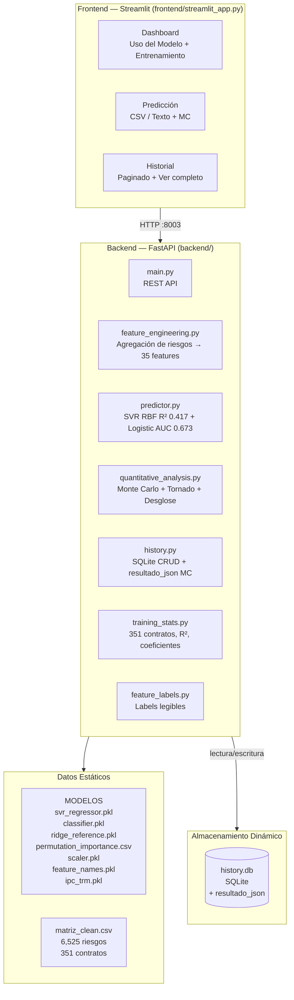
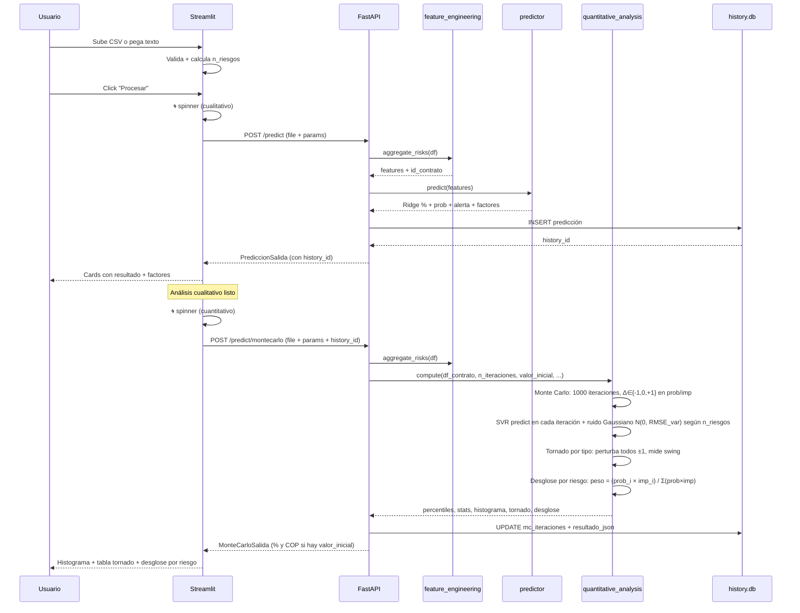
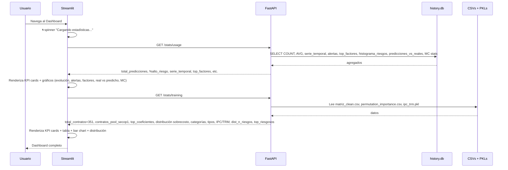
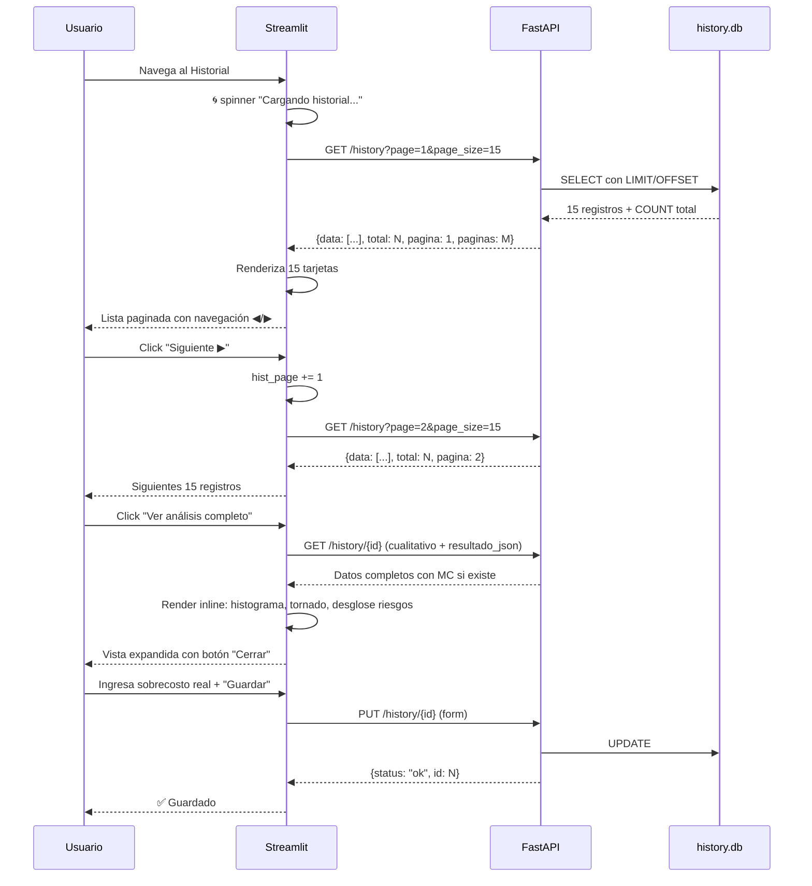
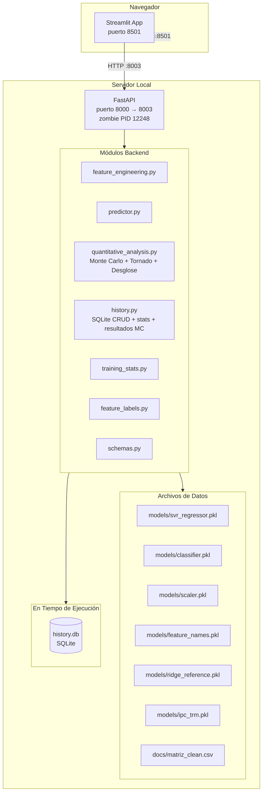
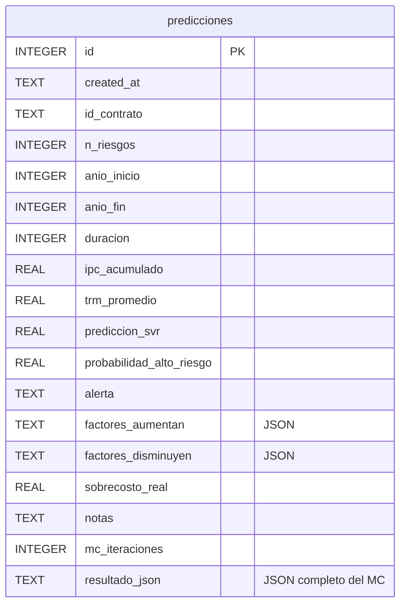

# Proceso de Identificación de Proyectos de Desarrollo Público en SECOP

## Contexto

**Tesis:** Maestría de José Luis Santamaría Andrade  
**Tema:** Predicción ML de matrices de riesgo en contratos públicos de Colombia  
**Objetivo del dato:** Identificar proyectos de inversión (Obra) terminados, con URL para acceder a matrices de riesgo, y con sobrecosto calculable como variable objetivo.

---

## 1. Fuentes de Datos

| # | ID | Nombre | Registros | Columnas | URL API |
|---|---|---|---|---|---|
| 1 | `f789-7hwg` | SECOP I - Procesos de Compra Pública | ~2.5M | 79 | `/resource/f789-7hwg.json` |
| 2 | `jbjy-vk9h` | SECOP II - Contratos Electrónicos | ~5.6M | 84+ | `/resource/jbjy-vk9h.json` |
| 3 | `5dsw-vah3` | SECOP II - Detalle | ~180K | 64 | `/resource/5dsw-vah3.json` |
| 4 | `bqww-w6pq` | SECOP I+II Integrado | ~22M | 10 | Descartado (pocas columnas) |

**Decisión final:** Usar SECOP I (`f789-7hwg`) para datos históricos liquidados y SECOP II (`jbjy-vk9h`) para datos recientes terminados. Ambos vía API de datos.gov.co con paginación (`$limit=50000`, `$offset`).

---

## 2. Pipeline de Extracción y Depuración

### 2.1 Scripts del proyecto

| Script | Función |
|---|---|
| `unificar_secop.py` | Descarga desde API SECOP I + II, cachea local, unifica en tabla común |
| `depurar.py` | Lee los cache, normaliza columnas, aplica filtros, exporta CSV depurado |
| `separar_fuentes.py`             | Divide `proyectos_depurados.csv` en SECOP I y SECOP II, elimina duplicados por URL en SECOP I |
| `excel_lite.py`                  | Versión reducida con columnas esenciales; SECOP I lite solo con `sobrecosto_pct > 0` |

### 2.2 Flujo de datos

```
SECOP I API (f789-7hwg)  ──┐
                           ├──> unificar_secop.py ──> cache CSV ──> depurar.py ──> proyectos_depurados.csv
SECOP II API (jbjy-vk9h) ──┘
```

### 2.3 Filtros aplicados (en orden)

| # | Paso | Descripción | Cómo |
|---|---|---|---|
| 1 | Tipo de contrato | Solo **Obra** | `tipo_de_contrato = 'Obra'` en query API |
| 2 | Destino del gasto | Solo **Inversión** | `destino_gasto = 'Inversión'` (SECOP I en query, SECOP II en post-filtro) |
| 3 | Valor mínimo | ≥ **$500M COP** | `valor_inicial >= 500e6` |
| 4 | Estado | Solo **terminados/liquidados/cerrados** | `estado in ('Liquidado', 'terminado', 'Cerrado')` |
| 5 | URL | Debe tener **URL válida** | `url` no nula ni vacía |
| 6 | Entidad | Debe tener **nombre de entidad** | `entidad` no vacía |

---

## 3. Variable Objetivo: Sobrecosto

### 3.1 Definición

```
sobrecosto_pct = ((valor_final - valor_inicial) / valor_inicial) × 100
```

### 3.2 Origen de los valores

| Fuente | valor_inicial | valor_final | Nota |
|---|---|---|---|---|
| SECOP I | `cuantia_contrato` | `valor_contrato_con_adiciones` | ✅ Adiciones incluidas, sobrecosto calculable |
| SECOP II | `valor_del_contrato` | `max(valor_pagado, valor_facturado)` | ⚠️ API no tiene columna de adiciones. Solo 5 registros con sobrecosto > 1% |

### 3.3 Interpretación

| Resultado | Significado |
|---|---|
| **+20%** | El proyecto costó 20% más de lo planeado → **sobrecosto** |
| **0%** | Costo final = costo inicial (sin cambios registrados) |
| **−10%** | El proyecto costó 10% menos → **ahorro** |
| **NaN** | No hay dato de valor_final (SECOP II sin pagos registrados) |

---

## 4. Resultados

### 4.1 Resumen numérico

| Etapa | SECOP I | SECOP II | Total |
|---|---|---|---|---|
| Descargados | 35,233 | 16,298 | 51,531 |
| Inversión | 35,233 | 10,848 | 46,081 |
| ≥ $500M | 5,500 | 3,446 | 8,946 |
| Terminados | 5,500 | 3,446 | **8,946** |
| Con URL | 5,500 | 3,446 | **8,946** |
| Con entidad | 5,500 | 3,446 | **8,946** |
| **Con sobrecosto ≠ 0** | 1,870 | 911 | **2,781** |
| Sobrecosto negativo eliminado | — | 908 | **908** |
| **Dataset final (`proyectos_depurados.csv`)** | **5,500** | **2,538** | **8,038** |
| Duplicados por URL (post-separación) | 777 | — | **777** |
| **SECOP I sin duplicados (`proyectos_secop1.csv`)** | **4,723** | — | **4,723** |
| Con sobrecosto > 0 (SECOP I lite) | **1,560** | — | **1,560** |

> **Nota:** El modelo ML se entrenó con **350 contratos** — aquellos que tienen matriz de riesgo extraída en `docs/matriz_clean.csv`. Los 1,560 son el pool total de candidatos SECOP I con sobrecosto > 0; el resto no alcanzó a tener su matriz extraída (proceso manual: PDF → OCR → LLM). Los 5 contratos SECOP II mapeados (C-110 a C-114) están incluidos dentro de esos 350.

### 4.2 Estadísticas de sobrecosto

| Métrica | Valor |
|---|---|
| Media | +11.9% |
| Mediana | 0.0% |
| Mínimo | 0.0% |
| Máximo | +24,972.8% (outlier, error de datos) |
| Proyectos con > 0% (SECOP I dedup) | 1,873 (1,560 en SECOP I) |
| Proyectos con < 0% | 0 (eliminados) |
| Proyectos con = 0% | 4,204 |

### 4.3 Columnas del dataset final (`proyectos_depurados.csv`)

| # | Columna | Descripción |
|---|---|---|
| 1 | `fuente` | SECOP I o SECOP II |
| 2 | `entidad` | Nombre de la entidad contratante |
| 3 | `departamento` | Departamento de ejecución |
| 4 | `municipio` | Municipio de ejecución |
| 5 | `valor_inicial` | Valor inicial del contrato |
| 6 | `valor_final` | Valor final (con adiciones o pagado) |
| 7 | `adiciones_dias` | Días de adición al plazo |
| 8 | `plazo_dias` | Plazo inicial en días |
| 9 | **`sobrecosto_pct`** | Variable objetivo: sobrecosto porcentual |
| 10 | `retraso_pct` | Retraso porcentual (adiciones/plazo) |
| 11 | `estado` | Estado del proceso |
| 12 | `objeto` | Descripción textual del contrato |
| 13 | **`url`** | URL en SECOP para acceder a matrices de riesgo |
| 14 | `contratista` | Proveedor adjudicado |
| 15 | `fecha_inicio` | Fecha de inicio |
| 16 | `fecha_fin` | Fecha de fin |
| 17 | `postconflicto` | Flag de acuerdo de paz (1=Sí, 0=No) |
| 18 | `destino_gasto` | Inversión (uniforme) |

---

### 4.4 Diagnóstico SECOP II — Complemento de 5 contratos

Durante la investigación se determinó que **SECOP II** (`jbjy-vk9h`) no expone datos confiables para calcular sobrecosto:

| Problema | Detalle |
|---|---|
| Sin columna de adiciones | No existe `valor_total_de_adiciones` ni `valor_contrato_con_adiciones` |
| `valor_pagado` = 0 | 49% de los registros tienen valor_pagado=0 (sin pagos registrados) |
| `valor_pagado ≈ valor_del_contrato` | Cuando hay pago, casi siempre es igual al valor del contrato (0% sobrecosto) |
| Portal con ReCaptcha | community.secop.gov.co bloquea scraping automatizado |
| Datasets alternativos | `6u7i-acw2` (salud, no SECOP), `vqec-u7ms` (Adiciones SECOP, vacío) |

Sin embargo, al revisar `docs/matriz.csv` se encontraron **5 contratos** con estructura de URL diferente (`community.secop.gov.co` en vez de `contratos.gov.co`). Estos se mapearon al `secop2_cache.csv` usando el `noticeUID` de la URL. Todos existen en la tabla `urlproceso` del cache SECOP II:

| Entidad | valor_inicial | valor_final | Sobrecosto |
|---|---|---|---|
| Caja de la Vivienda Popular (Grupo I) | $2,742M | $4,560M | +66.29% |
| Municipio de Entrerríos | $242M | $271M | +11.85% |
| ICBF Regional Tolima | $592M | $613M | +3.55% |
| Fondo Adaptación | $19,872M | $20,273M | +2.02% |
| Rama Judicial – Montería | $1,161M | $1,161M | +0.00% |

Los 4 primeros tienen sobrecosto real positivo. Rama Judicial tiene sobrecosto ~0% (incluido como testigo). Nota: en `secop2_cache` el noticeUID `CO1.NTC.2222959` (Caja de la Vivienda Popular) tiene 2 sub-contratos (Grupo I y III); el Grupo III arroja sobrecosto negativo (-5.24%) y se excluye del conjunto.

**Decisión final:** El dataset base del proyecto es **SECOP I** (4,723 registros, 1,560 con sobrecosto > 0). SECOP II se incluye como complemento menor (5 contratos en `contratos/secop2_con_sobrecosto.csv`). La tesis se sustenta principalmente en SECOP I.

---

## 5. Matrices de Riesgo

### 5.1 Dataset `matriz.csv`

**Ubicación original:** `C:\Users\Santa\Documents\Tesis\Matrices\matriz.csv` (copia en `docs/matriz.csv`)  
**Versión normalizada:** `docs/matriz_clean.csv` — generada por `estudio_data/normalizar.py`

El dataset original tiene 131 filas malformadas (padding/truncado a 20 columnas por mal quoting CSV) que se reparan automáticamente durante la normalización. El proceso NO modifica `matriz.csv`, solo lee de él y escribe `matriz_clean.csv`.

### 5.2 Pipeline de Normalización

`estudio_data/normalizar.py` aplica las siguientes transformaciones sobre `matriz.csv` para producir `matriz_clean.csv`:

| # | Transformación | Detalle |
|---|---|---|
| 1 | Lowercase + tildes | `quitar_tildes()` + `.lower()` en todas las columnas textuales |
| 2 | Espacios múltiples | `re.sub(r'\s+', ' ', s)` — colapsa espacios |
| 3 | **clase** (82→22 vars) | Mapeo de 60+ patrones regex a taxonomía SECOP canónica |
| 4 | **asignacion** (279→10 vars) | Mapa exacto + detección de entidades/contratistas + catch-all para textos descriptivos |
| 5 | **tipo** (265→17 vars) | Patrones multi-riesgo, palabras clave, mapa exacto |
| 6 | **etapa** (109→23 vars) | Patrones exactos + división de compuestos (`/`, `-`, `y`) con palabras clave |
| 7 | **fuente_riesgo** (47→4 vars) | Mapeo a `interno`, `externo`, `mixto`, `no especificado` |
| 8 | **probabilidad** (38→6 vars) | Escalas mixtas (0-1, 0-10, porcentual, textual) → 1-5 |
| 9 | **impacto** (40→6 vars) | Idem probabilidad |
| 10 | **categoria** (43→5 vars) | Textos → `bajo/medio/alto/extremo`; numéricos escalados con matriz estándar |
| 11 | **valoracion** (47 vars) | Ratings textuales → numérico; decimales .0 → enteros |
| 12 | Filas malformadas | Padding a 20 columnas si faltan, truncado si sobran |

**Resultado:** 72,123 normalizaciones aplicadas, 131 filas reparadas, 0 tildes, 0 valores numéricos no normalizados.

### 5.3 Columnas

| # | Columna | Descripción |
|---|---|---|
| 1 | `id_contrato` | Identificador único del contrato en la matriz |
| 2 | `valor_inicial` | Valor inicial del contrato |
| 3 | `valor_final` | Valor final del contrato |
| 4 | `sobrecosto` | Sobrecosto porcentual |
| 5 | **`url`** | URL en SECOP para acceder a la matriz de riesgo *(enriquecido desde SECOP I lite)* |
| 6 | **`objeto`** | Descripción textual del contrato *(enriquecido desde SECOP I lite)* |
| 7 | `fuente` | Entidad territorial |
| 8 | `id_riesgo` | Identificador del riesgo |
| 9 | `clase` | Clase de riesgo |
| 10 | `fuente_riesgo` | Fuente del riesgo |
| 11 | `etapa` | Etapa del proyecto |
| 12 | `tipo` | Tipo de riesgo |
| 13 | `descripcion_riesgo` | Descripción del riesgo |
| 14 | `consecuencia` | Consecuencia esperada |
| 15 | `probabilidad` | Probabilidad (1-5) |
| 16 | `impacto` | Impacto (1-5) |
| 17 | `valoracion` | Valoración del riesgo |
| 18 | `categoria` | Categoría del riesgo |
| 19 | `asignacion` | Asignación del riesgo |
| 20 | `plan_mitigacion` | Plan de mitigación |

### 5.4 Resumen del dataset

| Métrica | Valor |
|---|---|
| Filas totales | 6,525 |
| Contratos únicos | 351 (C-001 a C-351) |
| Riesgos por contrato | media 18.6, rango 3–58 |
| Con URL `contratos.gov.co` (SECOP I) | 346 |
| Con URL `community.secop.gov.co` (SECOP II) | 5 |
| Promedio sobrecosto | +27.53% (todos ≥ 0%) |
| Máximo sobrecosto | +808.76% (C-143, posible outlier) |
| Categorías residuales | 0 (solo bajo/medio/alto/extremo/no especificado) |
| Normalizaciones aplicadas | 72,123 en 9 campos categóricos |
| Tildes en el dataset | 0 |
| Valores vacíos categóricos | 0 (todos → "no especificado") |

---

## 6. Extracción de Matrices de Riesgo (Proceso Externo)

El dataset `matriz.csv` se construyó fuera del pipeline del repositorio. Para cada URL en `proyectos_secop1_lite.csv` se navegó al portal de contratos.gov.co, se descargó el PDF de la matriz de riesgos, y se extrajeron los campos estructurados (descripción, probabilidad, impacto, valoración, categoría, asignación, plan de mitigación) mediante LLM (DeepSeek Flash V4 como extractor principal, Gemini Standard Flash como validador, Google Lens API para OCR en PDFs escaneados).

**Archivo resultante:** `Tesis/Matrices/matriz.csv` — 6,525 filas, 20 columnas (copia en `docs/matriz.csv`).  
**Versión normalizada:** `docs/matriz_clean.csv` (131 filas con campos corridos por falta de quoting CSV fueron reparadas; 72,123 normalizaciones aplicadas por `estudio_data/normalizar.py`). El notebook de análisis (`estudio_data/matriz_inicial.ipynb`) usa esta versión.

---

## 7. Archivos del Proyecto

```
risk_project/
├── .gitignore                     # Excluye .csv, .xlsx, __pycache__, .venv/
├── unificar_secop.py              # Descarga SECOP I + II desde API, guarda cache
├── depurar.py                     # Lee cache, normaliza, filtra, exporta CSV final
├── separar_fuentes.py             # Divide depurados en SECOP I y SECOP II, elimina duplicados por URL en SECOP I
├── excel_lite.py                  # Versión reducida; SECOP I lite solo con sobrecosto > 0
├── estudio_data/
│   ├── normalizar.py              # Pipeline de normalización (lee matriz.csv, escribe matriz_clean.csv)
│   └── matriz_inicial.ipynb       # EDA con 29 celdas (distribuciones, correlaciones, conclusiones)
├── docs/
│   ├── proceso.md                 # Este documento
│   ├── matriz.csv                 # Dataset original enriquecido (6,525 filas, 20 cols) — 351 contratos
│   └── matriz_clean.csv           # Versión normalizada (131 filas reparadas, 72,123 normalizaciones)
└── contratos/
    ├── secop1_cache.csv           # Cache RAW SECOP I (35,233 registros) — excluido de git
    ├── secop2_cache.csv           # Cache RAW SECOP II (16,298 registros) — excluido de git
    ├── proyectos_depurados.csv    # Dataset maestro (8,038 proyectos, 18 cols) — excluido de git
    ├── proyectos_secop1.csv       # SECOP I sin duplicados (4,723) — excluido de git
    ├── proyectos_secop1_lite.csv  # 1,560, 10 cols — solo sobrecosto > 0 — excluido de git
    └── secop2_con_sobrecosto.csv  # 5 contratos SECOP II mapeados desde docs/matriz.csv — excluido de git

Tesis/
└── Matrices/
    └── matriz.csv                  # Dataset original (6,525 filas, 20 cols) — fuente primaria de docs/matriz.csv
```

---

## 8. Arquitectura del Prototipo

### 8.1 Visión General



### 8.2 Backend API (`backend/`)

Exposición REST con FastAPI. El frontend apunta a `http://localhost:8003` (workaround: zombie PID 12248 ocupó el puerto 8000; requiere reinicio de máquina para liberarlo). Originalmente en puerto `:8000`.

| Método | Endpoint | Parámetros | Respuesta | Propósito |
|--------|----------|-------------|-----------|-----------|
| `POST` | `/predict` | CSV file o texto + parámetros `(anio_inicio, anio_fin, ipc_override, trm_override)` | `PrediccionSalida` con factores, alerta, history_id | Ejecutar predicción sobre 1+N contratos con rango de fechas |
| `POST` | `/predict/montecarlo` | CSV + `(anio_inicio, anio_fin, ipc_override, trm_override, n_iteraciones, incluir_ruido, valor_inicial, history_id)` | `MonteCarloSalida` con percentiles, stats, histograma, tornado, desglose (en % y COP) | Simulación Monte Carlo + análisis cuantitativo por tipo y por riesgo individual |
| `GET` | `/history` | `page=1`, `page_size=15` | `{"data": [...], "total": N, "page": P, "paginas": M}` | Listar historial paginado |
| `GET` | `/history/{id}` | — | Cualitativo + `resultado_json` completo | Obtener predicción individual con MC |
| `GET` | `/history/{id}/resultados` | — | `resultado_json` completo del MC | Obtener solo resultados cuantitativos |
| `PUT` | `/history/{id}` | `sobrecosto_real`, `notas` (form) | `{"status": "ok", "id": N}` | Guardar validación (sobrecosto real observado) |
| `DELETE` | `/history/{id}` | — | `{"status": "ok", "id": N}` | Eliminar una predicción del historial |
| `DELETE` | `/history` | — | `{"status": "ok"}` | Limpiar todo el historial |
| `GET` | `/stats/usage` | — | Agregados de `history.db` (total predicciones, % alto riesgo, serie temporal, top factores, MC stats) | Dashboard de uso del modelo |
| `GET` | `/stats/training` | — | Agregados de datos de entrenamiento + coeficientes del modelo | Dashboard de entrenamiento |

### 8.3 Frontend — Vistas (Streamlit, `frontend/streamlit_app.py`)

La app es single-page con navegación vía `?view=` en query params:

| Vista | Ruta | Función | Contenido |
|-------|------|---------|-----------|
| Dashboard | `?view=dashboard` | `_render_dashboard()` | 2 tabs: "Uso del Modelo" (KPI cards, evolución, distribución alertas) y "Entrenamiento" (KPI cards, top features, tabla de riesgos por clase) |
| Predicción | `?view=predict` | `_render_predict()` | Selector CSV/texto, parámetros en sidebar, análisis cualitativo (alerta + factores) + cuantitativo (Monte Carlo con 1000 iteraciones, tornado por tipo de riesgo con swing real del modelo, histograma, desglose individual por peso prob×imp, valores en % y COP) |
| Historial | `?view=history` | `_render_history()` | Lista paginada (15/page) con contrato, alerta, Ridge, Prob., Real, botón eliminar, formulario de validación inline, y botón "Ver análisis completo" (expande inline el MC + cualitativo) |

### 8.4 Flujo de Datos — Predicción



### 8.5 Flujo de Datos — Dashboard



### 8.6 Flujo de Datos — Historial



### 8.7 Pipeline Completo

```mermaid
graph LR
    A[SECOP I API] --> B[unificar_secop.py]
    B --> C[secop1_cache.csv]
    C --> D[depurar.py]
    D --> E[proyectos_depurados.csv]
    E --> F[separar_fuentes.py]
    F --> G[proyectos_secop1.csv]
    G --> H[excel_lite.py]
    H --> I[proyectos_secop1_lite.csv<br/>1,560 contratos]
    I --> J[Extracción Matrices<br/>PDF → LLM → CSV]
    J --> K[matriz.csv<br/>6,525 riesgos]
    K --> L[normalizar.py]
    L --> M[matriz_clean.csv<br/>351 contratos]
    M --> N["Feature Engineering<br/>219 features → 35 (30 TF-IDF + 5 rango)"]
    N --> O["Modelo SVR RBF + Logistic<br/>R² 0.417 full · AUC 0.673<br/>350 contratos"]
    O --> P[svr_regressor.pkl<br/>permutation_importance.csv]
    P --> Q[FastAPI Backend<br/>/predict + /predict/montecarlo]
    Q --> Q2[quantitative_analysis.py<br/>MC + Tornado + Desglose]
    Q2 --> Q
    Q --> R[Streamlit Frontend<br/>Dashboard + Predicción + Historial]
    R --> S[Usuario Final]
    
    style Q fill:#4facfe,stroke:#333,color:white
    style Q2 fill:#6C5CE7,stroke:#333,color:white
    style R fill:#00B894,stroke:#333,color:white
    style S fill:#1ABC9C,stroke:#333,color:white
```



### 8.8 Arquitectura del Sistema



### 8.9 Modelo de Datos — SQLite (`history.db`)



| Columna | Tipo | Descripción |
|---------|------|-------------|
| `id` | INTEGER (PK) | Auto-incremental |
| `created_at` | TEXT | Timestamp ISO |
| `id_contrato` | TEXT | Identificador del contrato |
| `n_riesgos` | INTEGER | Cantidad de riesgos procesados |
| `anio_inicio` | INTEGER | Año de inicio del rango |
| `anio_fin` | INTEGER | Año de fin del rango |
| `duracion` | INTEGER | Duración en años (anio_fin - anio_inicio + 1) |
| `ipc_acumulado` | REAL | IPC acumulado del rango |
| `trm_promedio` | REAL | TRM promedio del rango |
| `prediccion_svr` | REAL | Sobrecosto estimado por SVR |
| `probabilidad_alto_riesgo` | REAL | Probabilidad de sobrecosto > 25% (0-1) |
| `alerta` | TEXT | `ALTO RIESGO` o `RIESGO MODERADO` |
| `factores_aumentan` | TEXT (JSON) | Top 5 factores que aumentan el sobrecosto |
| `factores_disminuyen` | TEXT (JSON) | Top 5 factores que disminuyen el sobrecosto |
| `sobrecosto_real` | REAL | Valor real observado (validación) |
| `notas` | TEXT | Notas de validación |
| `mc_iteraciones` | INTEGER | Número de iteraciones MC ejecutadas |
| `resultado_json` | TEXT (JSON) | Resultado completo del MC (percentiles, histograma, tornado, desglose) |

---

## 9. Funcionalidades del Prototipo

### 9.1 Dashboard — Uso del Modelo

- **KPI Cards:** Predicciones totales, Riesgos procesados, % Alto Riesgo, Sobrecosto Promedio, Predicciones con MC
  - Cada card tiene gradiente de color + badge con indicador ascendente/descendiente
  - Badge con fondo blanco y texto verde/rojo para máxima legibilidad
- **Gráficos:**
  - Evolución de predicciones (barras + línea de promedio)
  - Distribución de alertas (bar chart: ALTO RIESGO vs RIESGO MODERADO)
  - Top factores (apariciones en las predicciones)
  - Histograma de distribución de n_riesgos
  - Dispersión real vs predicho (cuando hay validaciones)
- **Spinner** de carga mientras se obtienen datos del backend

### 9.2 Dashboard — Entrenamiento

- **KPI Cards:** Contratos de entrenamiento (351, con badge del pool SECOP I de 1,560), Sobrecosto promedio/mediana, % Alto Riesgo (>25%), Riesgos en matriz (6,525), SECOP II incluidos (5), R² del modelo, RMSE
- **Tabla:** Top 10 features por permutation importance (positivos y negativos con label legible, del SVR + Ridge de referencia)
- **Distribución:** Barras por rango de sobrecosto (0-10%, 10-25%, 25-50%, 50-100%, 100%+)
- **Gráficos:** Distribución de riesgos por categoría (barras), por tipo (barras horizontales), top contratos por n_riesgos
- **Serie IPC/TRM:** Línea temporal de inflación y TRM por año
- **Spinner** de carga mientras se leen datos de entrenamiento

### 9.3 Predicción de Sobrecosto

- **Dos modos de entrada:**
  - Subir CSV con columnas `id_contrato, descripcion_riesgo, probabilidad, impacto, tipo, categoria`
  - Pegar texto CSV directamente
- **Parámetros desde sidebar:** Rango de fechas (anio_inicio, anio_fin con IPC/TRM automáticos), modo robusto
- **Al procesar:** spinner + llamado a `/predict`
- **Resultados por contrato:**
  - Card oscura con: ID del contrato, sobrecosto estimado (color según gravedad), barra de probabilidad de alto riesgo, alerta con icono
  - Factores que aumentan (verde) y disminuyen (rojo) el sobrecosto, con coeficientes
  - Formulario de validación inline para guardar sobrecosto real observado

### 9.4 Historial de Predicciones

- **Lista paginada:** 15 registros por página
- **Cada tarjeta muestra:** ID del contrato (con badge de alerta), fecha, n_riesgos, rango fechas, métricas (SVR, Prob., Real), top factores, notas, badge de MC si aplica
- **Navegación:** ◀ Anterior / Pág. X de Y · Mostrando registros 1–15 de N / Siguiente ▶
- **Acciones:** Eliminar individual, Limpiar todo, Guardar validación
- **"Ver análisis completo":** Botón centrado que expande inline la vista cualitativa + cuantitativa completa (histograma MC, tornado por tipo, desglose individual). Usa `GET /history/{id}` y `GET /history/{id}/resultados`. Keys de Streamlit con sufijo `{uid}` (hid) para evitar duplicados.
- **Spinner** de carga mientras se obtiene el historial

### 9.5 Experiencia de Usuario

- Spinners en todas las operaciones asíncronas (procesar, cargar dashboard, cargar historial)
- Encabezado con navegación tipo pestañas (Home / Predicción / Historial)
- Selector de modo oscuro/claro en sidebar
- Inputs con fondo blanco y texto negro para legibilidad
- KPI cards con gradientes y badges legibles (fondo blanco + texto de color)

---

## 10. Archivos del Prototipo

```
risk_project/
├── backend/
│   ├── main.py                   # FastAPI REST API (10 endpoints)
│   ├── schemas.py                # Pydantic models
│   ├── predictor.py              # Carga SVR + LogisticRegression (35 features, permutation importance)
│   ├── feature_engineering.py    # Agregación de riesgos → 35 features (rango fechas: anio_inicio, anio_fin, duracion, ipc_acumulado, trm_promedio)
│   ├── quantitative_analysis.py  # Monte Carlo (1000 iter, RMSE variable por n_riesgos), tornado, desglose
│   ├── history.py                # CRUD SQLite + stats + almacenamiento resultado_json del MC
│   ├── training_stats.py         # Estadísticas del dataset de entrenamiento (351 contratos)
│   └── feature_labels.py         # Labels legibles para features técnicas
├── frontend/
│   └── streamlit_app.py          # App Streamlit (~1150 líneas)
├── models/
│   ├── svr_regressor.pkl         # SVR campeón (R² 0.417 full, C=10, gamma=scale)
│   ├── classifier.pkl            # LogisticRegression (AUC 0.673)
│   ├── ridge_reference.pkl       # Ridge de referencia (coeficientes lineales)
│   ├── permutation_importance.csv# Importancia global del SVR (10 reps)
│   ├── scaler.pkl                # StandardScaler ajustado
│   ├── feature_names.pkl         # Lista de 35 feature names
│   ├── tfidf_vectorizer.pkl      # Vectorizador TF-IDF
│   └── ipc_trm.pkl               # Diccionario IPC/TRM por año
├── scripts/
│   └── train_final_model.py      # Entrenamiento reproducible del modelo final
├── docs/
│   ├── proceso.md                # Este documento
│   ├── modelo.md                 # Resultados del modelo (R², RMSE, features)
│   ├── matriz.csv                # Dataset original de matrices de riesgo
│   └── matriz_clean.csv          # Versión normalizada (351 contratos, 6,525 riesgos)
└── tests/
    ├── plan_de_pruebas.md        # Plan y resultados de validación (Grupos A y B)
    └── data/                     # CSVs de prueba por contrato
```

## 11. Pruebas de Validación

### 11.1 Diseño de Pruebas

Se diseñaron dos grupos de prueba para evaluar el modelo SVR de 35 features:

| Grupo | Propósito | Contratos | Origen |
|---|---|---|---|
| **A (Sanidad)** | Verificar que el pipeline produce predicciones consistentes y las alertas clasifican correctamente | C-001, C-010, C-017, C-043, C-128 | Del mismo dataset (`matriz_clean.csv`), seleccionados manualmente para cubrir distintos perfiles de riesgo |
| **B (Generalización)** | Evaluar capacidad del modelo con datos no vistos durante el entrenamiento | C-360 a C-364 | Proporcionados por el asesor como contratos reales de 2019-2023 con sobrecosto conocido |

Metodología: cada contrato se cargó manualmente vía "Pegar texto" en el frontend, con los parámetros IPC/TRM correspondientes a su rango de fechas.

### 11.2 Datos de Prueba

Ubicación: `tests/data/` — contiene los CSVs de cada contrato y el metadata `contratos_prueba.csv`.

| Contrato | Inicio | Fin | Valor Inicial | Valor Final | Sobrecosto Real | Perfil |
|---|---|---|---|---|---|---|---|
| C-001 | 2018 | 2019 | \$16,148M | \$20,760M | 28.6% | Medio |
| C-010 | 2018 | 2020 | \$31,074M | \$31,639M | 37.3% | Alto |
| C-017 | 2019 | 2022 | \$23,880M | \$36,561M | 53.1% | Muy Alto |
| C-043 | 2021 | 2022 | \$13,586M | \$13,886M | 2.2% | Muy Bajo |
| C-128 | 2019 | 2021 | \$5,217M | \$6,802M | 30.4% | Medio-Alto |
| C-360 | 2019 | 2019 | \$1,889M | \$2,080M | 10.14% | — |
| C-361 | 2022 | 2022 | \$1,886M | \$2,246M | 19.09% | — |
| C-362 | 2021 | 2021 | \$1,878M | \$1,960M | 4.38% | — |
| C-363 | 2022 | 2022 | \$1,869M | \$2,004M | 7.20% | — |
| C-364 | 2023 | 2023 | \$1,869M | \$2,258M | 20.83% | — |

### 11.3 Resultados Grupo A — Prueba de Sanidad

Modelo SVR con 35 features (30 TF-IDF + 5 rango: anio_inicio, anio_fin, duracion, ipc_acumulado, trm_promedio). R² full: 0.417, AUC: 0.673.

| Contrato | Inicio | Fin | Real | SVR | Error | Prob. | Alerta | Riesgos | RMSE | P90-P10 |
|---|---|---|---|---|---|---|---|---|---|---|
| C-001 | 2018 | 2019 | 28.6% | 25.01% | −3.6 pp | 81.7% | ALTO RIESGO | 12 | 16 pp | 41.9 pp |
| C-010 | 2018 | 2020 | 37.3% | 16.84% | −20.5 pp | 41.0% | RIESGO MODERADO | 20 | 16 pp | 40.7 pp |
| C-017 | 2019 | 2022 | 53.1% | 33.16% | −19.9 pp | 91.7% | ALTO RIESGO | 18 | 16 pp | 40.9 pp |
| C-043 | 2021 | 2022 | 2.2% | 28.54% | +26.3 pp | 80.7% | ALTO RIESGO | 22 | 20 pp | 51.7 pp |
| C-128 | 2019 | 2021 | 30.4% | 26.31% | −4.1 pp | 66.9% | ALTO RIESGO | 15 | 16 pp | 41.3 pp |

**MAE:** 14.9 pp | **Aciertos:** 3/5  
**Conclusión:** Tendencia a regresión a la media (C-010 subestimado, C-043 sobreestimado). La incertidumbre ahora varía según complejidad: C-043 (22 riesgos) tiene P90-P10 de 51.7 pp vs 41 pp de contratos más simples.

### 11.4 Validación contra Notebook (histórico)

El `modelado_v2.ipynb` se entrenó con Ridge de 33 features (año único). El modelo API actual es SVR con 35 features (rango de fechas). Las predicciones difieren por el cambio de modelo y feature set. Los resultados detallados del SVR se documentan en las secciones 11.3 y 11.5.

### 11.5 Resultados Grupo B — Prueba de Generalización

| Contrato | Inicio | Fin | Real | SVR | Error | Prob. | Alerta | Riesgos | RMSE | P90-P10 |
|---|---|---|---|---|---|---|---|---|---|---|
| C-360 | 2019 | 2019 | 10.14% | 15.55% | +5.4 pp | 21.4% | RIESGO MODERADO | 14 | 16 pp | 40.9 pp |
| C-361 | 2022 | 2022 | 19.09% | 16.99% | −2.1 pp | 60.2% | ALTO RIESGO | 28 | 20 pp | 51.9 pp |
| C-362 | 2021 | 2021 | 4.38% | 9.54% | +5.2 pp | 21.4% | RIESGO MODERADO | 27 | 20 pp | 50.5 pp |
| C-363 | 2022 | 2022 | 7.20% | 15.13% | +7.9 pp | 36.8% | RIESGO MODERADO | 14 | 16 pp | 40.8 pp |
| C-364 | 2023 | 2023 | 20.83% | 10.85% | −10.0 pp | 18.8% | RIESGO MODERADO | 34 | 24 pp | 62.1 pp |

**MAE:** 6.1 pp (< 20 pp ✅) | **Aciertos:** 4/5  
**Tiempo de respuesta:** < 2s por contrato (< 5s ✅)  
**Conclusión:** El SVR generaliza muy bien en datos no vistos (MAE 6.1 pp). C-364 (34 riesgos) tiene el intervalo más amplio (P90-P10=62.1 pp) por su RMSE de 24 pp, reflejando correctamente su alta complejidad.

---

## 12. Historial de Cambios

| Fecha | Cambio |
|---|---|
| 2026-06-23 | Definición de proyecto. Script `proyectos_inversion.py`: 525 proyectos Obra |
| 2026-06-25 | Unificación SECOP I + II. Filtro de terminados + URL. Variable sobrecosto. **8,946 proyectos** |
| 2026-06-25 | Eliminación de sobrecosto negativo. Separación por fuentes. **8,038 proyectos** (5,500 SECOP I + 2,538 SECOP II) |
| 2026-06-26 | Deduplicación SECOP I por URL (777 duplicados). Filtro a solo sobrecosto > 0 (1,560 registros) |
| 2026-06-26 | Enriquecimiento de `matriz.csv` con `url` y `objeto` desde SECOP I lite via join por `valor_final`. 1,522/1,526 filas con match |
| 2026-06-26 | Investigación SECOP II: API datos.gov.co no expone sobrecosto. Scraping bloqueado (ReCaptcha). Solo **5 registros** utilizables. Decisión: dataset base = SECOP I |
| 2026-07-06 | Auditoría `matriz.csv`: 129 filas con mal quoting reparadas. `matriz_clean.csv` creado |
| 2026-07-06 | Normalización: 72,123 normalizaciones en 9 campos. 351 contratos, 6,525 filas, 0 valores residuales |
| 2026-07-07 | Feature engineering: 219 features → reducción a 33 vía RF importance. Ridge campeón R² 0.103. XGBoost GPU probado. Optimizaciones descartadas |
| 2026-07-07 | Validación: 10 contratos (Grupo A sanidad + B generalización). MAE Grupo B: 11.3 pp |
| 2026-07-08 | Corrección: training_stats usaba pool SECOP I (1,560) en vez de contratos reales de entrenamiento (350) |
| 2026-07-09 | Re-entreno: se añadió `tfidf_obra`, eliminó `tfidf_cualquier`. Ridge R² 0.103→0.149, AUC 0.639→0.662 |
| 2026-07-09 | Análisis cuantitativo: Monte Carlo (1000 iter, ruido σ=RMSE_var), tornado por tipo, desglose individual |
| 2026-07-11 | Migración a rango de fechas (anio_inicio/anio_fin/ipc_acumulado/trm_promedio). Ridge no capturó no-linealidades (R² CV=0.066). **SVR RBF nuevo campeón** (R² CV=0.072, AUC=0.673). Permutation importance como interpretabilidad (SHAP incompatible con numba+numpy) |
| 2026-07-11 | RMSE variable por n_riesgos (12/16/20/24 pp). Validación: MAE=10.5 pp, 7/10 aciertos |
